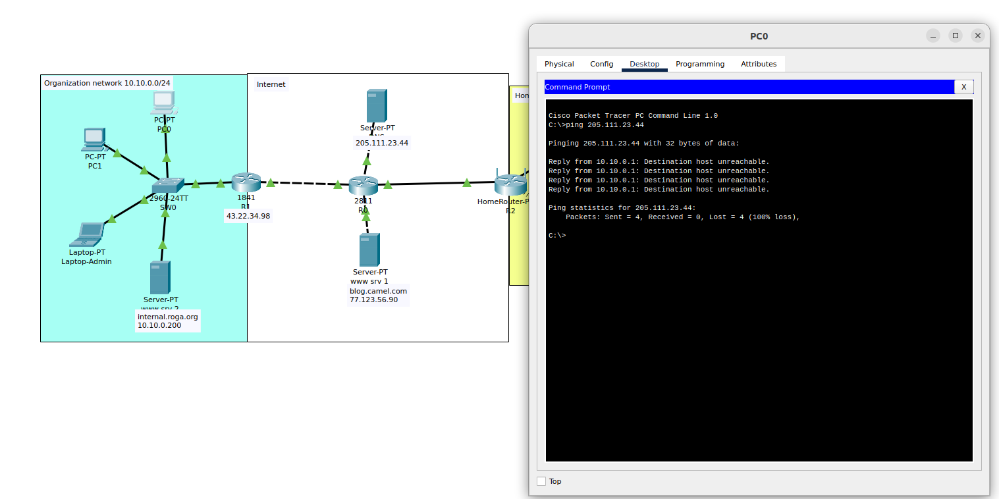
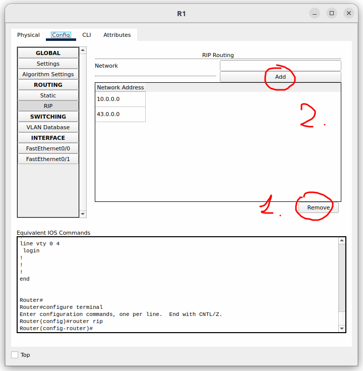
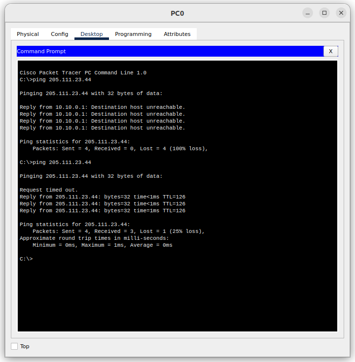
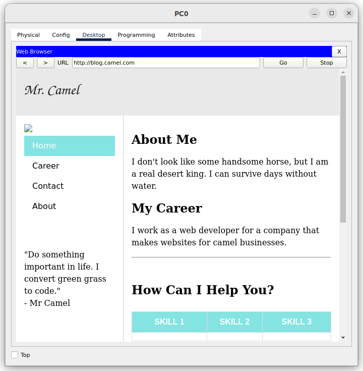
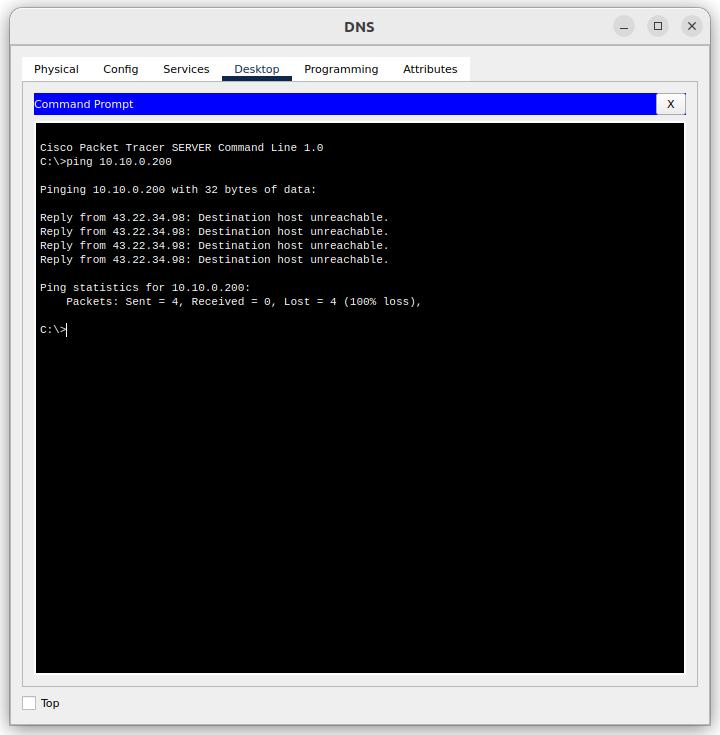

# Описание ошибки

Не смог разобраться с ошибкой после настройки интранета.
Пинг ходит из организации в интернет, а из интернета в сеть организации попасть нельзя.
Но, к сожалению, мое решение не работает при запуске, а если сделать шаги, которые я опишу далее, то решение будет работать, но ограниченное время.

Шаги:
1. Удалить маршруты в маршрутизаторе
2. Вернуть маршруты обратно

Скриншоты для примера:

